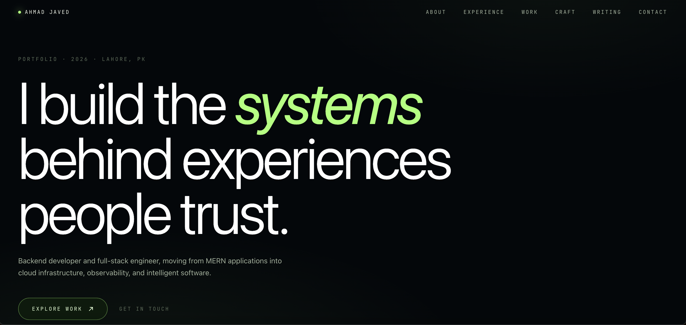

# Portfolio — Ahmad Javed

Next.js portfolio with a live GitHub contribution skyline.

🌐 **Live:** [portfolio-next-theta-henna.vercel.app](https://portfolio-next-theta-henna.vercel.app/)

## What's inside

- **Hero** — editorial headline with asymmetric layout
- **GitHub Skyline** — live contribution data, 2D heat map ↔ 3D isometric skyline
- **About** — pinned editorial column
- **Experience** — Harw Solutions internship
- **Work** — ODONTO-SCAN, CoinDom, Discord bot, CareerFlow
- **Craft** — security & craftsmanship principles
- **Capabilities** — skills matrix
- **Writing** — Medium articles
- **Contact** — mailto CTA

## Tech

Next.js 15 · TypeScript · Tailwind CSS v4 · Geist + Instrument Serif · Vercel

## GitHub Contribution Skyline

Fetches live contribution data on every page load. Uses the free public API:
